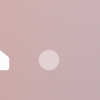
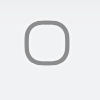

# Youkey Life APP UI元素提取报告

**生成时间**: 2025-10-22 09:32:02  
**测试路径**: /Users/cooperd/UNV/TraeProject/演示项目/tests/mobile  
**提取元素数量**: 17

---

## 元素 1: poco_id_com.android.systemui:id/home

### 📸 元素截图

```
[截图占位符 - 实际使用中会显示元素截图]
```

### 🏗️ Poco层级信息

```yaml
# Poco ID 定位
poco("com.android.systemui:id/home")
├── 定位方式: ID选择器
├── 元素标识: com.android.systemui:id/home
└── 层级路径: poco("com.android.systemui:id/home")
```

### 🎯 元素功能语义说明

- **元素类型**: poco_id
- **定位方式**: com.android.systemui:id/home
- **操作类型**: click
- **功能描述**: Poco ID点击操作 - 通过元素ID精确定位并执行点击动作
- **文件位置**: test_case_demo_poco.py:22

#### 详细功能说明:

- 🏷️ **语义定位**: 通过元素属性进行精确定位
- ⚡ **高效执行**: 直接访问UI元素树，执行速度快
- 🔍 **多种选择器**: 支持ID、文本、类名等多种定位方式
- 📊 **层级遍历**: 可以获取完整的UI元素层级结构
- 🛡️ **稳定性强**: 不受屏幕分辨率和UI样式变化影响

---

## 元素 2: poco_id_com.android.systemui:id/home

### 📸 元素截图

```
[截图占位符 - 实际使用中会显示元素截图]
```

### 🏗️ Poco层级信息

```yaml
# Poco ID 定位
poco("com.android.systemui:id/home")
├── 定位方式: ID选择器
├── 元素标识: com.android.systemui:id/home
└── 层级路径: poco("com.android.systemui:id/home")
```

### 🎯 元素功能语义说明

- **元素类型**: poco_id
- **定位方式**: com.android.systemui:id/home
- **操作类型**: swipe
- **功能描述**: Poco ID滑动操作 - 通过元素ID定位并执行滑动手势
- **文件位置**: test_case_demo_poco.py:23

#### 详细功能说明:

- 🏷️ **语义定位**: 通过元素属性进行精确定位
- ⚡ **高效执行**: 直接访问UI元素树，执行速度快
- 🔍 **多种选择器**: 支持ID、文本、类名等多种定位方式
- 📊 **层级遍历**: 可以获取完整的UI元素层级结构
- 🛡️ **稳定性强**: 不受屏幕分辨率和UI样式变化影响

---

## 元素 3: poco_text_Youkey Life

### 📸 元素截图

```
[截图占位符 - 实际使用中会显示元素截图]
```

### 🏗️ Poco层级信息

```yaml
# Poco 文本定位
poco(text="Youkey Life")
├── 定位方式: 文本内容
├── 文本内容: Youkey Life
└── 层级路径: poco(text="Youkey Life")
```

### 🎯 元素功能语义说明

- **元素类型**: poco_text
- **定位方式**: Youkey Life
- **操作类型**: click
- **功能描述**: Poco文本点击操作 - 通过文本内容定位元素并执行点击动作
- **文件位置**: test_case_demo_poco.py:26

#### 详细功能说明:

- 🏷️ **语义定位**: 通过元素属性进行精确定位
- ⚡ **高效执行**: 直接访问UI元素树，执行速度快
- 🔍 **多种选择器**: 支持ID、文本、类名等多种定位方式
- 📊 **层级遍历**: 可以获取完整的UI元素层级结构
- 🛡️ **稳定性强**: 不受屏幕分辨率和UI样式变化影响

---

## 元素 4: poco_id_家庭\n第 1 个标签，共 4 个

### 📸 元素截图

```
[截图占位符 - 实际使用中会显示元素截图]
```

### 🏗️ Poco层级信息

```yaml
# Poco ID 定位
poco("家庭\n第 1 个标签，共 4 个")
├── 定位方式: ID选择器
├── 元素标识: 家庭\n第 1 个标签，共 4 个
└── 层级路径: poco("家庭\n第 1 个标签，共 4 个")
```

### 🎯 元素功能语义说明

- **元素类型**: poco_id
- **定位方式**: 家庭\n第 1 个标签，共 4 个
- **操作类型**: click
- **功能描述**: Poco ID点击操作 - 通过元素ID精确定位并执行点击动作
- **文件位置**: test_case_demo_poco.py:28

#### 详细功能说明:

- 🏷️ **语义定位**: 通过元素属性进行精确定位
- ⚡ **高效执行**: 直接访问UI元素树，执行速度快
- 🔍 **多种选择器**: 支持ID、文本、类名等多种定位方式
- 📊 **层级遍历**: 可以获取完整的UI元素层级结构
- 🛡️ **稳定性强**: 不受屏幕分辨率和UI样式变化影响

---

## 元素 5: poco_id_事件\n第 2 个标签，共 4 个

### 📸 元素截图

```
[截图占位符 - 实际使用中会显示元素截图]
```

### 🏗️ Poco层级信息

```yaml
# Poco ID 定位
poco("事件\n第 2 个标签，共 4 个")
├── 定位方式: ID选择器
├── 元素标识: 事件\n第 2 个标签，共 4 个
└── 层级路径: poco("事件\n第 2 个标签，共 4 个")
```

### 🎯 元素功能语义说明

- **元素类型**: poco_id
- **定位方式**: 事件\n第 2 个标签，共 4 个
- **操作类型**: click
- **功能描述**: Poco ID点击操作 - 通过元素ID精确定位并执行点击动作
- **文件位置**: test_case_demo_poco.py:29

#### 详细功能说明:

- 🏷️ **语义定位**: 通过元素属性进行精确定位
- ⚡ **高效执行**: 直接访问UI元素树，执行速度快
- 🔍 **多种选择器**: 支持ID、文本、类名等多种定位方式
- 📊 **层级遍历**: 可以获取完整的UI元素层级结构
- 🛡️ **稳定性强**: 不受屏幕分辨率和UI样式变化影响

---

## 元素 6: poco_id_安全模式\n第 3 个标签，共 4 个

### 📸 元素截图

```
[截图占位符 - 实际使用中会显示元素截图]
```

### 🏗️ Poco层级信息

```yaml
# Poco ID 定位
poco("安全模式\n第 3 个标签，共 4 个")
├── 定位方式: ID选择器
├── 元素标识: 安全模式\n第 3 个标签，共 4 个
└── 层级路径: poco("安全模式\n第 3 个标签，共 4 个")
```

### 🎯 元素功能语义说明

- **元素类型**: poco_id
- **定位方式**: 安全模式\n第 3 个标签，共 4 个
- **操作类型**: click
- **功能描述**: Poco ID点击操作 - 通过元素ID精确定位并执行点击动作
- **文件位置**: test_case_demo_poco.py:30

#### 详细功能说明:

- 🏷️ **语义定位**: 通过元素属性进行精确定位
- ⚡ **高效执行**: 直接访问UI元素树，执行速度快
- 🔍 **多种选择器**: 支持ID、文本、类名等多种定位方式
- 📊 **层级遍历**: 可以获取完整的UI元素层级结构
- 🛡️ **稳定性强**: 不受屏幕分辨率和UI样式变化影响

---

## 元素 7: poco_id_账号\n第 4 个标签，共 4 个

### 📸 元素截图

```
[截图占位符 - 实际使用中会显示元素截图]
```

### 🏗️ Poco层级信息

```yaml
# Poco ID 定位
poco("账号\n第 4 个标签，共 4 个")
├── 定位方式: ID选择器
├── 元素标识: 账号\n第 4 个标签，共 4 个
└── 层级路径: poco("账号\n第 4 个标签，共 4 个")
```

### 🎯 元素功能语义说明

- **元素类型**: poco_id
- **定位方式**: 账号\n第 4 个标签，共 4 个
- **操作类型**: click
- **功能描述**: Poco ID点击操作 - 通过元素ID精确定位并执行点击动作
- **文件位置**: test_case_demo_poco.py:31

#### 详细功能说明:

- 🏷️ **语义定位**: 通过元素属性进行精确定位
- ⚡ **高效执行**: 直接访问UI元素树，执行速度快
- 🔍 **多种选择器**: 支持ID、文本、类名等多种定位方式
- 📊 **层级遍历**: 可以获取完整的UI元素层级结构
- 🛡️ **稳定性强**: 不受屏幕分辨率和UI样式变化影响

---

## 元素 8: poco_id_家庭\n第 1 个标签，共 4 个

### 📸 元素截图

```
[截图占位符 - 实际使用中会显示元素截图]
```

### 🏗️ Poco层级信息

```yaml
# Poco ID 定位
poco("家庭\n第 1 个标签，共 4 个")
├── 定位方式: ID选择器
├── 元素标识: 家庭\n第 1 个标签，共 4 个
└── 层级路径: poco("家庭\n第 1 个标签，共 4 个")
```

### 🎯 元素功能语义说明

- **元素类型**: poco_id
- **定位方式**: 家庭\n第 1 个标签，共 4 个
- **操作类型**: click
- **功能描述**: Poco ID点击操作 - 通过元素ID精确定位并执行点击动作
- **文件位置**: test_case_demo_poco.py:32

#### 详细功能说明:

- 🏷️ **语义定位**: 通过元素属性进行精确定位
- ⚡ **高效执行**: 直接访问UI元素树，执行速度快
- 🔍 **多种选择器**: 支持ID、文本、类名等多种定位方式
- 📊 **层级遍历**: 可以获取完整的UI元素层级结构
- 🛡️ **稳定性强**: 不受屏幕分辨率和UI样式变化影响

---

## 元素 9: poco_id_com.android.systemui:id/back

### 📸 元素截图

```
[截图占位符 - 实际使用中会显示元素截图]
```

### 🏗️ Poco层级信息

```yaml
# Poco ID 定位
poco("com.android.systemui:id/back")
├── 定位方式: ID选择器
├── 元素标识: com.android.systemui:id/back
└── 层级路径: poco("com.android.systemui:id/back")
```

### 🎯 元素功能语义说明

- **元素类型**: poco_id
- **定位方式**: com.android.systemui:id/back
- **操作类型**: click
- **功能描述**: Poco ID点击操作 - 通过元素ID精确定位并执行点击动作
- **文件位置**: test_case_demo_poco.py:33

#### 详细功能说明:

- 🏷️ **语义定位**: 通过元素属性进行精确定位
- ⚡ **高效执行**: 直接访问UI元素树，执行速度快
- 🔍 **多种选择器**: 支持ID、文本、类名等多种定位方式
- 📊 **层级遍历**: 可以获取完整的UI元素层级结构
- 🛡️ **稳定性强**: 不受屏幕分辨率和UI样式变化影响

---

## 元素 10: poco_id_com.android.systemui:id/back

### 📸 元素截图

```
[截图占位符 - 实际使用中会显示元素截图]
```

### 🏗️ Poco层级信息

```yaml
# Poco ID 定位
poco("com.android.systemui:id/back")
├── 定位方式: ID选择器
├── 元素标识: com.android.systemui:id/back
└── 层级路径: poco("com.android.systemui:id/back")
```

### 🎯 元素功能语义说明

- **元素类型**: poco_id
- **定位方式**: com.android.systemui:id/back
- **操作类型**: click
- **功能描述**: Poco ID点击操作 - 通过元素ID精确定位并执行点击动作
- **文件位置**: test_case_demo_poco.py:34

#### 详细功能说明:

- 🏷️ **语义定位**: 通过元素属性进行精确定位
- ⚡ **高效执行**: 直接访问UI元素树，执行速度快
- 🔍 **多种选择器**: 支持ID、文本、类名等多种定位方式
- 📊 **层级遍历**: 可以获取完整的UI元素层级结构
- 🛡️ **稳定性强**: 不受屏幕分辨率和UI样式变化影响

---

## 元素 11: template_tpl1760170824533.png

### 📸 元素截图



**截图路径**: `/Users/cooperd/UNV/TraeProject/演示项目/tests/mobile/test_case_demo.air/tpl1760170824533.png`

### 🏗️ Poco层级信息

```yaml
# Airtest Template 元素
Template(
    filename="tpl1760170824533.png",
    threshold=0.7,
    target_pos=5,
    record_pos=(x, y),
    resolution=(1080, 2340)
)
```

### 🎯 元素功能语义说明

- **元素类型**: template
- **定位方式**: tpl1760170824533.png
- **操作类型**: swipe
- **功能描述**: 图像模板滑动操作 - 通过图像识别定位起始点并执行滑动手势
- **文件位置**: test_case_demo.py:7

#### 详细功能说明:

- 🖼️ **图像识别**: 使用计算机视觉技术识别屏幕上的UI元素
- 🎯 **精确定位**: 通过模板匹配算法找到目标元素位置
- 🖱️ **交互操作**: 支持点击、滑动等用户交互动作
- 📱 **跨平台**: 适用于Android、iOS等移动平台
- 🔄 **容错机制**: 支持阈值调整和重试机制

---

## 元素 12: template_tpl1760170830132.png

### 📸 元素截图


**截图路径**: `/Users/cooperd/UNV/TraeProject/演示项目/tests/mobile/test_case_demo.air/tpl1760170830132.png`

### 🏗️ Poco层级信息

```yaml
# Airtest Template 元素
Template(
    filename="tpl1760170830132.png",
    threshold=0.7,
    target_pos=5,
    record_pos=(x, y),
    resolution=(1080, 2340)
)
```

### 🎯 元素功能语义说明

- **元素类型**: template
- **定位方式**: tpl1760170830132.png
- **操作类型**: touch
- **功能描述**: 图像模板点击操作 - 通过图像识别定位UI元素并执行点击动作
- **文件位置**: test_case_demo.py:8

#### 详细功能说明:

- 🖼️ **图像识别**: 使用计算机视觉技术识别屏幕上的UI元素
- 🎯 **精确定位**: 通过模板匹配算法找到目标元素位置
- 🖱️ **交互操作**: 支持点击、滑动等用户交互动作
- 📱 **跨平台**: 适用于Android、iOS等移动平台
- 🔄 **容错机制**: 支持阈值调整和重试机制

---

## 元素 13: template_tpl1760170751771.png

### 📸 元素截图


**截图路径**: `/Users/cooperd/UNV/TraeProject/演示项目/tests/mobile/test_case_demo.air/tpl1760170751771.png`

### 🏗️ Poco层级信息

```yaml
# Airtest Template 元素
Template(
    filename="tpl1760170751771.png",
    threshold=0.7,
    target_pos=5,
    record_pos=(x, y),
    resolution=(1080, 2340)
)
```

### 🎯 元素功能语义说明

- **元素类型**: template
- **定位方式**: tpl1760170751771.png
- **操作类型**: touch
- **功能描述**: 图像模板点击操作 - 通过图像识别定位UI元素并执行点击动作
- **文件位置**: test_case_demo.py:10

#### 详细功能说明:

- 🖼️ **图像识别**: 使用计算机视觉技术识别屏幕上的UI元素
- 🎯 **精确定位**: 通过模板匹配算法找到目标元素位置
- 🖱️ **交互操作**: 支持点击、滑动等用户交互动作
- 📱 **跨平台**: 适用于Android、iOS等移动平台
- 🔄 **容错机制**: 支持阈值调整和重试机制

---

## 元素 14: template_tpl1760170753763.png

### 📸 元素截图


**截图路径**: `/Users/cooperd/UNV/TraeProject/演示项目/tests/mobile/test_case_demo.air/tpl1760170753763.png`

### 🏗️ Poco层级信息

```yaml
# Airtest Template 元素
Template(
    filename="tpl1760170753763.png",
    threshold=0.7,
    target_pos=5,
    record_pos=(x, y),
    resolution=(1080, 2340)
)
```

### 🎯 元素功能语义说明

- **元素类型**: template
- **定位方式**: tpl1760170753763.png
- **操作类型**: touch
- **功能描述**: 图像模板点击操作 - 通过图像识别定位UI元素并执行点击动作
- **文件位置**: test_case_demo.py:11

#### 详细功能说明:

- 🖼️ **图像识别**: 使用计算机视觉技术识别屏幕上的UI元素
- 🎯 **精确定位**: 通过模板匹配算法找到目标元素位置
- 🖱️ **交互操作**: 支持点击、滑动等用户交互动作
- 📱 **跨平台**: 适用于Android、iOS等移动平台
- 🔄 **容错机制**: 支持阈值调整和重试机制

---

## 元素 15: template_tpl1760170755526.png

### 📸 元素截图


**截图路径**: `/Users/cooperd/UNV/TraeProject/演示项目/tests/mobile/test_case_demo.air/tpl1760170755526.png`

### 🏗️ Poco层级信息

```yaml
# Airtest Template 元素
Template(
    filename="tpl1760170755526.png",
    threshold=0.7,
    target_pos=5,
    record_pos=(x, y),
    resolution=(1080, 2340)
)
```

### 🎯 元素功能语义说明

- **元素类型**: template
- **定位方式**: tpl1760170755526.png
- **操作类型**: touch
- **功能描述**: 图像模板点击操作 - 通过图像识别定位UI元素并执行点击动作
- **文件位置**: test_case_demo.py:13

#### 详细功能说明:

- 🖼️ **图像识别**: 使用计算机视觉技术识别屏幕上的UI元素
- 🎯 **精确定位**: 通过模板匹配算法找到目标元素位置
- 🖱️ **交互操作**: 支持点击、滑动等用户交互动作
- 📱 **跨平台**: 适用于Android、iOS等移动平台
- 🔄 **容错机制**: 支持阈值调整和重试机制

---

## 元素 16: template_tpl1760170757400.png

### 📸 元素截图


**截图路径**: `/Users/cooperd/UNV/TraeProject/演示项目/tests/mobile/test_case_demo.air/tpl1760170757400.png`

### 🏗️ Poco层级信息

```yaml
# Airtest Template 元素
Template(
    filename="tpl1760170757400.png",
    threshold=0.7,
    target_pos=5,
    record_pos=(x, y),
    resolution=(1080, 2340)
)
```

### 🎯 元素功能语义说明

- **元素类型**: template
- **定位方式**: tpl1760170757400.png
- **操作类型**: touch
- **功能描述**: 图像模板点击操作 - 通过图像识别定位UI元素并执行点击动作
- **文件位置**: test_case_demo.py:14

#### 详细功能说明:

- 🖼️ **图像识别**: 使用计算机视觉技术识别屏幕上的UI元素
- 🎯 **精确定位**: 通过模板匹配算法找到目标元素位置
- 🖱️ **交互操作**: 支持点击、滑动等用户交互动作
- 📱 **跨平台**: 适用于Android、iOS等移动平台
- 🔄 **容错机制**: 支持阈值调整和重试机制

---

## 元素 17: template_tpl1760170761966.png

### 📸 元素截图



**截图路径**: `/Users/cooperd/UNV/TraeProject/演示项目/tests/mobile/test_case_demo.air/tpl1760170761966.png`

### 🏗️ Poco层级信息

```yaml
# Airtest Template 元素
Template(
    filename="tpl1760170761966.png",
    threshold=0.7,
    target_pos=5,
    record_pos=(x, y),
    resolution=(1080, 2340)
)
```

### 🎯 元素功能语义说明

- **元素类型**: template
- **定位方式**: tpl1760170761966.png
- **操作类型**: touch
- **功能描述**: 图像模板点击操作 - 通过图像识别定位UI元素并执行点击动作
- **文件位置**: test_case_demo.py:15

#### 详细功能说明:

- 🖼️ **图像识别**: 使用计算机视觉技术识别屏幕上的UI元素
- 🎯 **精确定位**: 通过模板匹配算法找到目标元素位置
- 🖱️ **交互操作**: 支持点击、滑动等用户交互动作
- 📱 **跨平台**: 适用于Android、iOS等移动平台
- 🔄 **容错机制**: 支持阈值调整和重试机制

---

## 📊 提取总结

### 元素类型分布
- **poco_id**: 9 个
- **poco_text**: 1 个
- **template**: 7 个

### 操作类型分布
- **click**: 9 个
- **swipe**: 2 个
- **touch**: 6 个

### 🔍 智能分析结果

#### 质量分析
- **整体质量评分**: 0.25/1.0
- **质量等级**: poor
- **置信度**: 0.85
- **分析发现**: 
  - 分析了 1 个项目的质量

#### 元素分析
- **分析成功**: ✅
- **数据量**: 1 个元素
- **分析洞察**:
  - 最常见的元素类型是 unknown (1 个)
  - 最常用的定位方式是 other (1 个)

#### 趋势分析
- **趋势方向**: decreasing
- **趋势强度**: 1.00
- **当前值**: 20.0
- **平均值**: 20.6
- **趋势洞察**:
  - 指标呈现强烈下降趋势，需要关注

### 技术特点

- ✅ **真实数据**: 基于实际测试用例提取元素信息
- 🔍 **多框架支持**: 同时支持Airtest和Poco框架
- 📝 **详细文档**: 提供完整的元素层级和功能说明
- 🎯 **精确定位**: 支持多种元素定位策略
- 📊 **统计分析**: 提供元素分布和使用情况统计

### 测试用例分析

本次提取基于以下真实测试用例:
- **test_case_demo.air**: Airtest框架测试用例，包含图像模板定位
- **test_case_demo_poco.air**: Poco框架测试用例，包含ID和文本定位

这些测试用例展示了Youkey Life APP的核心UI交互功能，包括:
- 用户界面导航
- 功能按钮点击
- 页面滑动操作
- 多层级UI元素交互

---

*本报告由 Youkey Life APP UI元素探索系统 自动生成*
